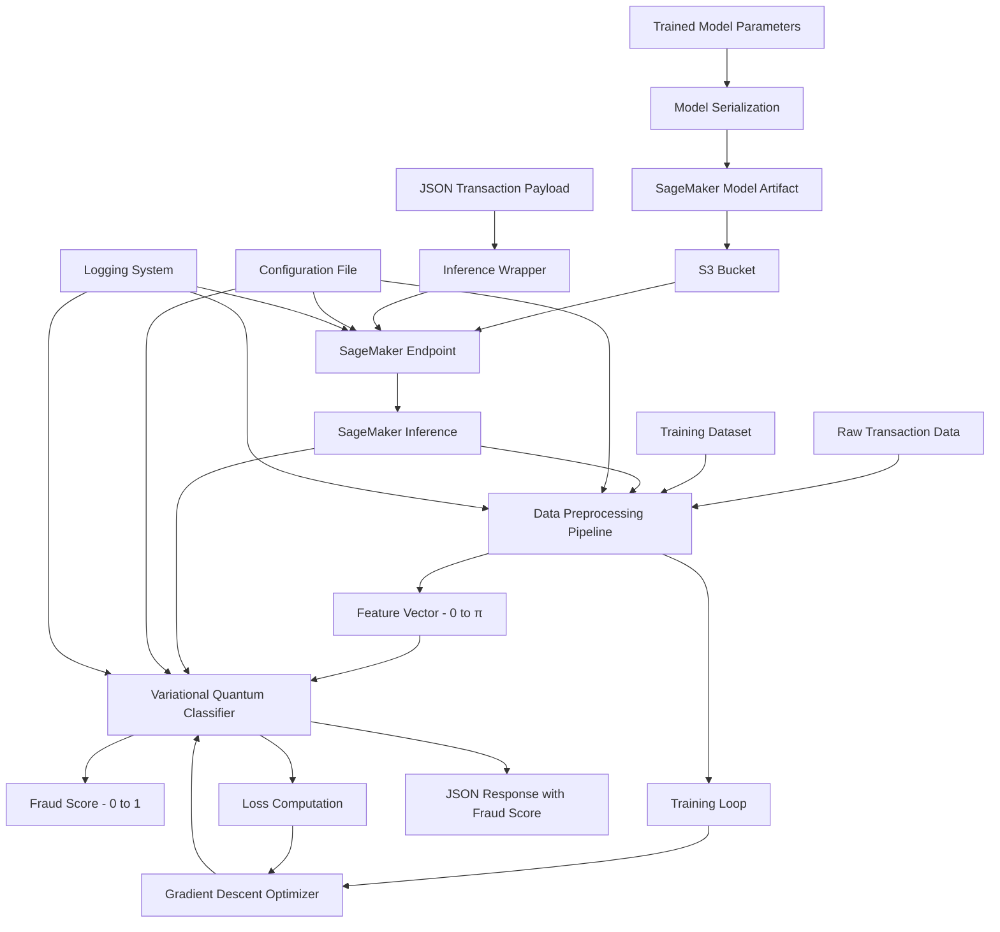

# Design Document

## Overview

The Quantum Machine Learning Financial Fraud Detector is a hybrid quantum-classical system that leverages quantum computing for binary classification of financial transactions. The system architecture consists of three primary layers:

1. **Classical Preprocessing Layer**: Transforms raw transaction data into normalized feature vectors suitable for quantum encoding
2. **Quantum Machine Learning Layer**: A Variational Quantum Classifier (VQC) implemented in PennyLane that processes features through parameterized quantum circuits
3. **Deployment and Inference Layer**: AWS SageMaker-based serving infrastructure for real-time predictions

The system follows a standard machine learning workflow: data preprocessing → model training → serialization → deployment → inference. The key innovation is the replacement of classical neural network layers with a quantum circuit that exploits quantum superposition and entanglement for feature learning.

### Key Design Decisions

**Quantum Framework Selection**: PennyLane was chosen for its differentiability, seamless integration with classical ML frameworks (NumPy, PyTorch, TensorFlow), and hardware-agnostic design that supports multiple quantum backends.

**Angle Encoding**: Features are encoded using rotation gates (RX, RY, RZ) where classical feature values directly parameterize quantum gate angles. This encoding is efficient and compatible with near-term quantum devices.

**SageMaker Deployment**: AWS SageMaker provides enterprise-grade model serving with horizontal scaling, monitoring, and A/B testing capabilities, making it suitable for production fraud detection workloads.

**Hybrid Architecture**: The design maintains a clear separation between classical preprocessing (handled efficiently on CPUs) and quantum inference (executed on quantum simulators or hardware), optimizing resource utilization.

## Architecture

### System Architecture Diagram



### Component Interaction Flow

**Training Flow**:
1. Raw transaction CSV/JSON → Data Preprocessing Pipeline
2. Preprocessed features → VQC with random initialization
3. VQC predictions → Binary cross-entropy loss
4. Gradients → Parameter optimization via Adam/SGD
5. Trained parameters + fitted scaler → Disk serialization (pickle/joblib)

**Deployment Flow**:
1. Load serialized model artifacts from disk
2. Package into SageMaker-compatible tar.gz with inference script
3. Upload to S3 bucket
4. Create SageMaker Model resource pointing to S3 artifact
5. Create Endpoint Configuration with instance specifications
6. Deploy Endpoint and wait for "InService" status

**Inference Flow**:
1. Client sends JSON transaction via HTTPS POST to SageMaker endpoint
2. Inference Wrapper validates and parses JSON
3. Apply fitted preprocessing transformation
4. Pass feature vector to VQC
5. VQC executes quantum circuit and produces prediction
6. Format prediction as JSON with fraud score and metadata
7. Return response to client (target: <500ms)

### Deployment Architecture

The system deploys to AWS with the following components:

- **S3 Bucket**: Stores model artifacts (model.tar.gz containing trained parameters and scaler)
- **SageMaker Model**: References S3 artifact and inference Docker container
- **SageMaker Endpoint Configuration**: Defines instance type (ml.m5.large/xlarge), instance count, and auto-scaling policies
- **SageMaker Endpoint**: Real-time HTTPS inference service with load balancing
- **CloudWatch**: Logs and metrics for monitoring (invocation count, latency, errors)

The deployment supports horizontal scaling by increasing instance count in the endpoint configuration, enabling the system to handle variable load patterns typical in fraud detection scenarios.

## Components and Interfaces

### 1. Data Preprocessing Pipeline

**Purpose**: Transform raw transaction data into normalized feature vectors compatible with quantum angle encoding.

**Implementation**:
- **Language**: Python 3.8+
- **Dependencies**: pandas (data loading), scikit-learn (preprocessing), numpy (numerical operations)
- **Module**: `preprocessing.py`

**Core Classes**:

```python
class TransactionPreprocessor:
    """Handles end-to-end preprocessing of transaction data."""
    
    def __init__(self, categorical_columns: List[str], numerical_columns: List[str]):
        """
        Initialize preprocessor with column specifications.
        
        Args:
            categorical_columns: List of categorical feature names
            numerical_columns: List of numerical feature names
        """
        self.categorical_columns = categorical_columns
        self.numerical_columns = numerical_columns
        self.scaler = MinMaxScaler(feature_range=(0, np.pi))
        self.label_encoders = {}  # One per categorical column
        self.is_fitted = False
    
    def fit(self, df: pd.DataFrame) -> None:
        """
        Fit preprocessing transformations on training data.
        
        Args:
            df: DataFrame containing raw transaction data
        """
        pass
    
    def transform(self, df: pd.DataFrame) -> np.ndarray:
        """
        Apply fitted transformations to generate feature vectors.
        
        Args:
            df: DataFrame to transform
            
        Returns:
            Array of shape (n_samples, n_features) with values in [0, π]
        """
        pass
    
    def fit_transform(self, df: pd.DataFrame) -> np.ndarray:
        """Convenience method combining fit and transform."""
        pass
    
    def inverse_transform(self, features: np.ndarray) -> pd.DataFrame:
        """
        Reverse transformation for debugging/interpretation.
        
        Args:
            features: Normalized feature array
            
        Returns:
            DataFrame with original-scale values
        """
        pass
```

**Processing Steps**:
1. **Missing Value Handling**: Use `SimpleImputer` with mean strategy for numerical, mode for categorical
2. **Categorical Encoding**: Apply `LabelEncoder` to convert strings to integers
3. **Numerical Scaling**: Use `MinMaxScaler` to map all features to [0, π] range
4. **Feature Vector Construction**: Concatenate encoded categorical and scaled numerical features

**Interfaces**:
- **Input**: pandas DataFrame with raw transaction columns (amount, merchant_category, time_of_day, etc.)
- **Output**: NumPy array of shape `(n_transactions, n_features)` with float64 values in [0, π]
- **Persistence**: `save()` and `load()` methods using `joblib.dump/load`

**Error Handling**:
- Raise `ValueError` if input DataFrame missing required columns
- Raise `ValueError` if `transform()` called before `fit()`
- Log warning if numerical values exceed expected ranges during inference

### 2. Variational Quantum Classifier (VQC)

**Purpose**: Binary classification using parameterized quantum circuits with angle-encoded features.

**Implementation**:
- **Language**: Python 3.8+
- **Dependencies**: pennylane, numpy
- **Module**: `quantum_model.py`

**Core Classes**:

```python
class VariationalQuantumClassifier:
    """Quantum binary classifier with angle encoding and variational layers."""
    
    def __init__(self, n_qubits: int, n_layers: int, device_name: str = "default.qubit"):
        """
        Initialize VQC with circuit specifications.
        
        Args:
            n_qubits: Number of qubits in circuit (must match n_features)
            n_layers: Depth of variational layers
            device_name: PennyLane device name (simulator or hardware)
        """
        self.n_qubits = n_qubits
        self.n_layers = n_layers
        self.device = qml.device(device_name, wires=n_qubits)
        self.params = None  # Shape: (n_layers, n_qubits, 3) for Rot gates
    
    def initialize_params(self, seed: int = 42) -> None:
        """Initialize variational parameters randomly."""
        pass
    
    def circuit(self, features: np.ndarray, params: np.ndarray) -> float:
        """
        Define quantum circuit with angle encoding and variational layers.
        
        Args:
            features: Input feature vector of length n_qubits, values in [0, π]
            params: Trainable parameters for variational gates
            
        Returns:
            Expectation value in range [-1, 1]
        """
        pass
    
    def predict(self, features: np.ndarray) -> float:
        """
        Run inference on a single feature vector.
        
        Args:
            features: Single feature vector
            
        Returns:
            Fraud score in [0, 1]
        """
        pass
    
    def predict_batch(self, features: np.ndarray) -> np.ndarray:
        """
        Run inference on multiple feature vectors.
        
        Args:
            features: Array of shape (batch_size, n_qubits)
            
        Returns:
            Array of fraud scores, shape (batch_size,)
        """
        pass
```

**Quantum Circuit Architecture**:

The circuit consists of:

1. **Angle Encoding Layer** (non-trainable):
   ```python
   for i in range(n_qubits):
       qml.RY(features[i], wires=i)  # Encode feature as rotation angle
   ```

2. **Variational Layers** (repeated n_layers times):
   ```python
   # Trainable rotations
   for i in range(n_qubits):
       qml.Rot(params[layer, i, 0], params[layer, i, 1], params[layer, i, 2], wires=i)
   
   # Entanglement (ring topology)
   for i in range(n_qubits):
       qml.CNOT(wires=[i, (i + 1) % n_qubits])
   ```

3. **Measurement**:
   ```python
   return qml.expval(qml.PauliZ(0))  # Measure qubit 0 in Z basis
   ```

**Output Transformation**:
The quantum circuit returns an expectation value in [-1, 1]. This is mapped to a fraud score via:
```python
fraud_score = (expectation_value + 1) / 2  # Maps [-1, 1] to [0, 1]
```

**Parameter Count**:
Total trainable parameters = `n_layers × n_qubits × 3`
- Example: 4 qubits, 2 layers → 24 parameters

**Interfaces**:
- **Input**: Feature vector of length `n_qubits` with values in [0, π]
- **Output**: Fraud score (float) in [0, 1]
- **Training Interface**: Expose `circuit` as PennyLane QNode for gradient computation
- **Persistence**: Save/load `params` array using NumPy or pickle

### 3. Training Module

**Purpose**: Optimize VQC parameters using labeled training data.

**Implementation**:
- **Language**: Python 3.8+
- **Dependencies**: pennylane, numpy, scikit-learn (metrics)
- **Module**: `training.py`

**Core Functions**:

```python
def train_model(
    X_train: np.ndarray,
    y_train: np.ndarray,
    X_val: np.ndarray,
    y_val: np.ndarray,
    model: VariationalQuantumClassifier,
    epochs: int = 50,
    learning_rate: float = 0.01,
    optimizer: str = "adam"
) -> Dict[str, List[float]]:
    """
    Train VQC using gradient descent.
    
    Args:
        X_train: Training features, shape (n_train, n_qubits)
        y_train: Training labels, shape (n_train,), values in {0, 1}
        X_val: Validation features
        y_val: Validation labels
        model: VQC instance to train
        epochs: Number of training epochs
        learning_rate: Step size for optimizer
        optimizer: Optimizer type ("adam", "sgd", "nesterov")
        
    Returns:
        Dictionary containing training history:
        {
            "train_loss": [...],
            "val_loss": [...],
            "val_accuracy": [...],
            "val_precision": [...],
            "val_recall": [...],
            "val_f1": [...]
        }
    """
    pass

def compute_metrics(y_true: np.ndarray, y_pred: np.ndarray, threshold: float = 0.5) -> Dict[str, float]:
    """
    Compute classification metrics.
    
    Args:
        y_true: Ground truth labels
        y_pred: Predicted fraud scores
        threshold: Classification threshold
        
    Returns:
        Dictionary with accuracy, precision, recall, F1-score
    """
    pass
```

**Training Algorithm**:
1. Initialize VQC parameters randomly
2. For each epoch:
   - Shuffle training data
   - For each batch:
     - Forward pass: compute predictions
     - Compute binary cross-entropy loss
     - Backward pass: compute gradients using PennyLane autodiff
     - Update parameters using optimizer
   - Compute validation metrics
   - Log progress
3. Return trained parameters and history

**Loss Function**:
Binary cross-entropy:
```python
loss = -np.mean(y_true * np.log(y_pred + epsilon) + (1 - y_true) * np.log(1 - y_pred + epsilon))
```
where epsilon = 1e-7 prevents log(0).

**Gradient Computation**:
PennyLane provides automatic differentiation:
```python
qnode = qml.QNode(model.circuit, model.device)
grad_fn = qml.grad(qnode)
gradients = grad_fn(features, params)
```

**Optimization**:
Use PennyLane optimizers:
- `qml.AdamOptimizer`: Adaptive learning rate, recommended default
- `qml.GradientDescentOptimizer`: Basic SGD
- `qml.NesterovMomentumOptimizer`: SGD with momentum

**Interfaces**:
- **Input**: Preprocessed training/validation data + VQC instance
- **Output**: Trained VQC with optimized parameters + training history dictionary
- **Side Effects**: Updates VQC parameters in-place

### 4. Model Serialization Module

**Purpose**: Persist and restore trained models for deployment.

**Implementation**:
- **Language**: Python 3.8+
- **Dependencies**: pickle, joblib, numpy
- **Module**: `serialization.py`

**Core Functions**:

```python
def save_model(
    model: VariationalQuantumClassifier,
    preprocessor: TransactionPreprocessor,
    save_dir: str,
    metadata: Dict[str, Any] = None
) -> None:
    """
    Save complete model state to disk.
    
    Args:
        model: Trained VQC instance
        preprocessor: Fitted preprocessing pipeline
        save_dir: Directory to save artifacts
        metadata: Optional dict with training info (accuracy, date, etc.)
    """
    # Save structure:
    # save_dir/
    #   model_params.npy       - VQC parameter array
    #   model_config.json      - VQC architecture (n_qubits, n_layers, device)
    #   preprocessor.pkl       - Fitted TransactionPreprocessor
    #   metadata.json          - Training metadata
    pass

def load_model(load_dir: str) -> Tuple[VariationalQuantumClassifier, TransactionPreprocessor, Dict]:
    """
    Restore model from disk.
    
    Args:
        load_dir: Directory containing saved artifacts
        
    Returns:
        Tuple of (model, preprocessor, metadata)
    """
    pass
```

**Serialization Format**:
- **VQC Parameters**: Save as NumPy array using `np.save()` (efficient binary format)
- **VQC Configuration**: Save as JSON (n_qubits, n_layers, device_name)
- **Preprocessor**: Save using `joblib.dump()` (preserves scikit-learn objects)
- **Metadata**: Save as JSON (training accuracy, timestamp, dataset info)

**Round-Trip Guarantee**:
The design ensures that `load_model(save_model(model, path))` produces a model with identical predictions (within floating-point tolerance) on the same inputs. This satisfies Requirement 6's round-trip property.

**Interfaces**:
- **Input**: Trained model + preprocessor instances
- **Output**: Files written to specified directory
- **Loading**: Reconstruct identical model state from saved files

### 5. AWS SageMaker Deployment Module

**Purpose**: Deploy trained models to SageMaker for scalable real-time inference.

**Implementation**:
- **Language**: Python 3.8+
- **Dependencies**: boto3, sagemaker (AWS SDK)
- **Module**: `deployment.py`

**Core Classes**:

```python
class SageMakerDeployer:
    """Handles SageMaker model deployment workflow."""
    
    def __init__(self, 
                 region: str,
                 role_arn: str,
                 s3_bucket: str,
                 model_name: str,
                 endpoint_name: str):
        """
        Initialize deployer with AWS configuration.
        
        Args:
            region: AWS region (e.g., "us-east-1")
            role_arn: IAM role ARN for SageMaker execution
            s3_bucket: S3 bucket for model artifacts
            model_name: SageMaker model name
            endpoint_name: SageMaker endpoint name
        """
        self.region = region
        self.role_arn = role_arn
        self.s3_bucket = s3_bucket
        self.model_name = model_name
        self.endpoint_name = endpoint_name
        self.sagemaker_client = boto3.client('sagemaker', region_name=region)
        self.s3_client = boto3.client('s3', region_name=region)
    
    def package_model(self, model_dir: str, output_path: str) -> str:
        """
        Package model artifacts into SageMaker-compatible tar.gz.
        
        Expected structure:
        model.tar.gz
          ├── code/
          │   └── inference.py  (custom inference handler)
          ├── model_params.npy
          ├── model_config.json
          └── preprocessor.pkl
        
        Args:
            model_dir: Directory containing saved model artifacts
            output_path: Path to write model.tar.gz
            
        Returns:
            Path to created tar.gz file
        """
        pass
    
    def upload_to_s3(self, local_path: str, s3_key: str) -> str:
        """
        Upload model artifact to S3.
        
        Args:
            local_path: Local file path
            s3_key: S3 object key
            
        Returns:
            S3 URI (s3://bucket/key)
        """
        pass
    
    def create_model(self, model_data_url: str, instance_type: str = "ml.m5.large") -> None:
        """
        Create SageMaker model resource.
        
        Args:
            model_data_url: S3 URI of model.tar.gz
            instance_type: EC2 instance type for endpoint
        """
        pass
    
    def create_endpoint_config(self, instance_type: str, instance_count: int = 1) -> None:
        """
        Create or update endpoint configuration.
        
        Args:
            instance_type: EC2 instance type (e.g., "ml.m5.large")
            instance_count: Number of instances for load balancing
        """
        pass
    
    def deploy_endpoint(self, wait: bool = True) -> str:
        """
        Create or update SageMaker endpoint.
        
        Args:
            wait: If True, block until endpoint reaches "InService" status
            
        Returns:
            Endpoint status
        """
        pass
    
    def check_endpoint_status(self) -> str:
        """Query current endpoint status."""
        pass
    
    def delete_endpoint(self) -> None:
        """Delete endpoint to stop charges."""
        pass
```

**Deployment Workflow**:
1. **Package**: Create tar.gz with model files + inference.py
2. **Upload**: Push to S3 bucket
3. **Create Model**: Register model artifact with SageMaker
4. **Create Endpoint Config**: Specify instance type/count
5. **Deploy Endpoint**: Launch inference service
6. **Wait**: Poll status until "InService" (typically 5-10 minutes)

**Container Image**:
Use AWS-provided PennyLane container or build custom Dockerfile:
```dockerfile
FROM python:3.8-slim
RUN pip install pennylane numpy pandas scikit-learn boto3
COPY inference.py /opt/ml/code/
ENV SAGEMAKER_PROGRAM inference.py
```

**Interfaces**:
- **Input**: Path to saved model directory + AWS configuration
- **Output**: Deployed SageMaker endpoint URL
- **Error Handling**: Raise exceptions with descriptive messages for each deployment step failure

### 6. Inference Wrapper Module

**Purpose**: Handle real-time prediction requests on SageMaker endpoint.

**Implementation**:
- **Language**: Python 3.8+
- **Dependencies**: json, numpy, logging
- **Module**: `inference.py` (deployed to SageMaker)

**Core Functions**:

```python
def model_fn(model_dir: str) -> Tuple[VariationalQuantumClassifier, TransactionPreprocessor]:
    """
    Load model artifacts (called once at endpoint startup).
    
    Args:
        model_dir: Directory containing model artifacts (/opt/ml/model on SageMaker)
        
    Returns:
        Tuple of (model, preprocessor)
    """
    pass

def input_fn(request_body: str, content_type: str) -> Dict[str, Any]:
    """
    Parse incoming request payload.
    
    Args:
        request_body: Raw request body string
        content_type: Content-Type header (expected: "application/json")
        
    Returns:
        Parsed transaction dictionary
        
    Raises:
        ValueError: If content_type is not JSON or body is malformed
    """
    pass

def predict_fn(transaction: Dict[str, Any], model_tuple: Tuple) -> Dict[str, float]:
    """
    Run inference on parsed transaction.
    
    Args:
        transaction: Parsed transaction dictionary
        model_tuple: (model, preprocessor) from model_fn
        
    Returns:
        Dictionary with fraud_score and prediction metadata
    """
    pass

def output_fn(prediction: Dict[str, float], accept: str) -> str:
    """
    Format prediction as JSON response.
    
    Args:
        prediction: Prediction dictionary from predict_fn
        accept: Accept header (expected: "application/json")
        
    Returns:
        JSON string
    """
    pass
```

**Request/Response Format**:

**Request** (JSON):
```json
{
  "transaction_id": "tx_12345",
  "amount": 523.45,
  "merchant_category": "online_retail",
  "time_of_day": 14.5,
  "location_distance": 12.3,
  "card_present": false
}
```

**Response** (JSON):
```json
{
  "transaction_id": "tx_12345",
  "fraud_score": 0.87,
  "prediction": "fraud",
  "threshold": 0.5,
  "processing_time_ms": 142,
  "model_version": "v1.0.0"
}
```

**Error Response** (JSON):
```json
{
  "error": "ValidationError",
  "message": "Missing required field: amount",
  "transaction_id": "tx_12345"
}
```

**Performance Requirements**:
- **Preprocessing**: <50ms
- **Quantum Circuit Execution**: <200ms (Requirement 10.3)
- **Total Latency**: <500ms (Requirement 5.8, 10.1)

**Interfaces**:
- **Input**: HTTPS POST request with JSON body
- **Output**: JSON response with fraud score
- **SageMaker Integration**: Implements SageMaker inference handler functions

### 7. Configuration Module

**Purpose**: Centralize system configuration for flexibility across environments.

**Implementation**:
- **Language**: Python 3.8+
- **Dependencies**: os, json, yaml
- **Module**: `config.py`

**Configuration Schema**:

```python
@dataclass
class QuantumConfig:
    """Quantum circuit configuration."""
    n_qubits: int = 4
    n_layers: int = 2
    device: str = "default.qubit"  # or "lightning.qubit", hardware backend

@dataclass
class TrainingConfig:
    """Training hyperparameters."""
    epochs: int = 50
    learning_rate: float = 0.01
    batch_size: int = 32
    optimizer: str = "adam"
    validation_split: float = 0.2

@dataclass
class SageMakerConfig:
    """AWS SageMaker deployment configuration."""
    region: str = "us-east-1"
    instance_type: str = "ml.m5.large"
    instance_count: int = 1
    s3_bucket: str = ""
    role_arn: str = ""
    model_name: str = "quantum-fraud-detector"
    endpoint_name: str = "quantum-fraud-endpoint"

@dataclass
class PreprocessingConfig:
    """Data preprocessing configuration."""
    categorical_columns: List[str] = field(default_factory=list)
    numerical_columns: List[str] = field(default_factory=list)
    handle_missing: str = "mean"  # or "median", "drop"

class ConfigLoader:
    """Load configuration from file or environment variables."""
    
    @staticmethod
    def load_from_file(config_path: str) -> Dict[str, Any]:
        """Load from YAML/JSON configuration file."""
        pass
    
    @staticmethod
    def load_from_env() -> Dict[str, Any]:
        """Load from environment variables with prefix QFRAUD_"""
        pass
    
    @staticmethod
    def merge_configs(*configs: Dict) -> Dict[str, Any]:
        """Merge multiple config sources with priority."""
        pass
```

**Configuration Sources** (priority order):
1. Command-line arguments (highest priority)
2. Environment variables (`QFRAUD_N_QUBITS`, `QFRAUD_REGION`, etc.)
3. Configuration file (`config.yaml` or `config.json`)
4. Default values (lowest priority)

**Example config.yaml**:
```yaml
quantum:
  n_qubits: 4
  n_layers: 2
  device: "lightning.qubit"

training:
  epochs: 100
  learning_rate: 0.005
  optimizer: "adam"

sagemaker:
  region: "us-west-2"
  instance_type: "ml.m5.xlarge"
  instance_count: 2
  s3_bucket: "my-fraud-models"

preprocessing:
  categorical_columns: ["merchant_category", "card_type"]
  numerical_columns: ["amount", "time_of_day", "location_distance"]
```

**Validation**:
The `ConfigLoader` validates configuration on load:
- Check required fields are present
- Validate value ranges (e.g., n_qubits > 0, learning_rate > 0)
- Verify AWS credentials and S3 bucket access
- Raise descriptive errors for invalid configurations (Requirement 8.7)

**Interfaces**:
- **Input**: Configuration file path or environment variables
- **Output**: Validated configuration dictionaries
- **Error Handling**: Raise `ConfigurationError` with missing/invalid field details

### 8. Logging Module

**Purpose**: Provide comprehensive structured logging for monitoring and debugging.

**Implementation**:
- **Language**: Python 3.8+
- **Dependencies**: logging, json, time
- **Module**: `logging_config.py`

**Logger Setup**:

```python
import logging
import json
from datetime import datetime

class StructuredLogger:
    """JSON-formatted logger for machine-readable logs."""
    
    def __init__(self, name: str, log_level: str = "INFO"):
        """
        Initialize structured logger.
        
        Args:
            name: Logger name (typically module name)
            log_level: Logging level (DEBUG, INFO, WARNING, ERROR)
        """
        self.logger = logging.getLogger(name)
        self.logger.setLevel(getattr(logging, log_level))
        
        # JSON formatter
        handler = logging.StreamHandler()
        handler.setFormatter(self._json_formatter())
        self.logger.addHandler(handler)
    
    def _json_formatter(self) -> logging.Formatter:
        """Create JSON log formatter."""
        pass
    
    def log_preprocessing(self, transaction_id: str, n_features: int, duration_ms: float) -> None:
        """Log preprocessing operation (Requirement 9.1)."""
        self.logger.info(json.dumps({
            "event": "preprocessing",
            "transaction_id": transaction_id,
            "n_features": n_features,
            "duration_ms": duration_ms,
            "timestamp": datetime.utcnow().isoformat()
        }))
    
    def log_quantum_execution(self, transaction_id: str, n_qubits: int, duration_ms: float) -> None:
        """Log quantum circuit execution (Requirement 9.2)."""
        self.logger.info(json.dumps({
            "event": "quantum_execution",
            "transaction_id": transaction_id,
            "n_qubits": n_qubits,
            "duration_ms": duration_ms,
            "timestamp": datetime.utcnow().isoformat()
        }))
    
    def log_sagemaker_invocation(self, endpoint: str, status: str, latency_ms: float, error: str = None) -> None:
        """Log SageMaker endpoint invocation (Requirement 9.3)."""
        pass
    
    def log_model_loaded(self, model_version: str, config: Dict[str, Any]) -> None:
        """Log model loading (Requirement 9.4)."""
        pass
    
    def log_error(self, error_type: str, message: str, stack_trace: str = None) -> None:
        """Log errors with stack traces (Requirement 9.5)."""
        pass
```

**Log Event Types**:
1. **preprocessing**: Feature transformation operations
2. **quantum_execution**: Quantum circuit runs
3. **sagemaker_invocation**: Endpoint calls
4. **model_loaded**: Model initialization
5. **validation_error**: Input validation failures
6. **runtime_error**: Unexpected exceptions

**Log Format** (JSON):
```json
{
  "timestamp": "2025-06-15T10:23:45.123Z",
  "level": "INFO",
  "event": "quantum_execution",
  "transaction_id": "tx_12345",
  "n_qubits": 4,
  "duration_ms": 145.2,
  "module": "quantum_model"
}
```

**Integration Points**:
- All modules import and use `StructuredLogger`
- Logs sent to stdout (captured by CloudWatch on SageMaker)
- Log level configurable via environment variable `LOG_LEVEL`

**Interfaces**:
- **Input**: Log events from all modules
- **Output**: JSON-formatted log lines to stdout/stderr
- **Monitoring**: Compatible with CloudWatch Logs Insights queries

## Data Models

### Transaction Data Model

**Raw Transaction Schema** (input to preprocessing):
```python
{
    "transaction_id": str,         # Unique identifier
    "amount": float,               # Transaction amount (USD)
    "merchant_category": str,      # Category code (e.g., "retail", "restaurant")
    "time_of_day": float,          # Hour of day (0-24)
    "day_of_week": int,            # 0=Monday, 6=Sunday
    "location_distance": float,    # Distance from cardholder location (km)
    "card_present": bool,          # Physical card used?
    "online_transaction": bool,    # Online purchase?
    "previous_fraud": bool,        # Prior fraud on this card?
    "label": int                   # 0=legitimate, 1=fraud (training only)
}
```

**Feature Vector** (after preprocessing):
```python
np.ndarray with shape (n_features,)
dtype: float64
value_range: [0, π]
```

Example with 4 qubits:
```python
features = np.array([1.23, 2.45, 0.89, 3.01])  # Each value in [0, π]
```

**Fraud Prediction Model**:
```python
{
    "transaction_id": str,
    "fraud_score": float,          # Probability of fraud [0, 1]
    "prediction": str,             # "fraud" or "legitimate"
    "threshold": float,            # Classification threshold used
    "processing_time_ms": float,   # Inference latency
    "model_version": str           # Model version identifier
}
```

### Model Artifact Structure

**Saved Model Directory**:
```
model_artifacts/
├── model_params.npy           # VQC parameter array, shape (n_layers, n_qubits, 3)
├── model_config.json          # {"n_qubits": 4, "n_layers": 2, "device": "default.qubit"}
├── preprocessor.pkl           # Pickled TransactionPreprocessor with fitted scaler
└── metadata.json              # {"version": "1.0.0", "accuracy": 0.94, "trained_at": "..."}
```

**SageMaker Model Artifact** (model.tar.gz):
```
model.tar.gz
├── code/
│   └── inference.py           # SageMaker inference handler
├── model_params.npy
├── model_config.json
├── preprocessor.pkl
└── metadata.json
```

### Configuration Data Model

**System Configuration**:
```yaml
version: "1.0"
quantum:
  n_qubits: 4
  n_layers: 2
  device: "default.qubit"
training:
  epochs: 50
  learning_rate: 0.01
  optimizer: "adam"
sagemaker:
  region: "us-east-1"
  instance_type: "ml.m5.large"
  instance_count: 1
preprocessing:
  categorical_columns: ["merchant_category"]
  numerical_columns: ["amount", "time_of_day", "location_distance"]
```

### Quantum Circuit Parameters

**Parameter Array Structure**:
```python
params.shape = (n_layers, n_qubits, 3)
params.dtype = float64
```

Example for 2 layers, 4 qubits:
```python
params = np.array([
    [[φ₁, θ₁, ω₁], [φ₂, θ₂, ω₂], [φ₃, θ₃, ω₃], [φ₄, θ₄, ω₄]],  # Layer 0
    [[φ₅, θ₅, ω₅], [φ₆, θ₆, ω₆], [φ₇, θ₇, ω₇], [φ₈, θ₈, ω₈]]   # Layer 1
])
```
Each triple `[φ, θ, ω]` parameterizes a `Rot` gate (equivalent to `RZ(ω) RY(θ) RZ(φ)`).

## Error Handling

### Error Categories

**1. Input Validation Errors** (Requirement 7.1, 7.2):
- **Missing Required Fields**: Transaction lacks required columns
- **Type Mismatches**: Non-numeric values in numeric fields
- **Out-of-Range Values**: Negative amounts, invalid dates

**Handling Strategy**:
- Validate input schema before preprocessing
- Return HTTP 400 with descriptive JSON error message
- Log validation errors with transaction ID

**Example**:
```python
class ValidationError(Exception):
    """Raised for invalid input data."""
    pass

def validate_transaction(transaction: Dict) -> None:
    required_fields = ["amount", "merchant_category", "time_of_day"]
    missing = [f for f in required_fields if f not in transaction]
    if missing:
        raise ValidationError(f"Missing required fields: {', '.join(missing)}")
    
    if not isinstance(transaction["amount"], (int, float)):
        raise ValidationError(f"Field 'amount' must be numeric, got {type(transaction['amount'])}")
    
    if transaction["amount"] < 0:
        raise ValidationError("Field 'amount' must be non-negative")
```

**2. Quantum Execution Errors** (Requirement 7.4):
- **Device Unavailable**: Quantum hardware/simulator inaccessible
- **Circuit Execution Failure**: Numerical instability, timeout

**Handling Strategy**:
- Catch PennyLane exceptions during circuit execution
- Log full stack trace with quantum circuit details
- Return HTTP 500 with generic error message (don't expose internals)
- Implement retry logic with exponential backoff (up to 3 retries)

**Example**:
```python
def execute_circuit_with_retry(features, params, max_retries=3):
    for attempt in range(max_retries):
        try:
            return qnode(features, params)
        except Exception as e:
            logger.log_error("quantum_execution_error", str(e), traceback.format_exc())
            if attempt == max_retries - 1:
                raise RuntimeError("Quantum circuit execution failed after retries")
            time.sleep(2 ** attempt)  # Exponential backoff
```

**3. AWS Service Errors** (Requirement 7.5):
- **Endpoint Unavailable**: SageMaker endpoint down or updating
- **Throttling**: Too many requests
- **Authentication Errors**: Invalid credentials

**Handling Strategy**:
- Catch `boto3` exceptions (e.g., `ModelError`, `EndpointNotFoundError`)
- Return HTTP 503 (Service Unavailable) with retry guidance
- Log error details including AWS request ID
- Use exponential backoff with jitter for retries

**Example Error Response**:
```json
{
  "error": "ServiceUnavailable",
  "message": "SageMaker endpoint is temporarily unavailable. Please retry in 30 seconds.",
  "retry_after_seconds": 30,
  "request_id": "req_abc123"
}
```

**4. Model Loading Errors**:
- **Missing Artifacts**: Model files not found
- **Version Mismatch**: Incompatible model format
- **Corruption**: Corrupted pickle/numpy files

**Handling Strategy**:
- Validate all artifacts exist before loading
- Check version compatibility (compare saved version vs. code version)
- Fail fast at startup (don't deploy endpoint if model can't load)
- Log detailed error with file paths and versions

**5. Preprocessing Errors** (Requirement 7.3):
- **Out-of-Range Features**: Values outside training distribution
- **Unfitted Preprocessor**: `transform()` called before `fit()`

**Handling Strategy**:
- Clip out-of-range values to [0, π] and log warning (Requirement 7.3)
- Raise exception if preprocessor not fitted
- Track preprocessing failures in metrics

**Example**:
```python
def safe_scale(self, values: np.ndarray) -> np.ndarray:
    if not self.is_fitted:
        raise ValueError("Preprocessor must be fitted before transform")
    
    scaled = self.scaler.transform(values)
    
    # Clip to valid range and warn if clipping occurred
    clipped = np.clip(scaled, 0, np.pi)
    if not np.array_equal(scaled, clipped):
        logger.warning(f"Feature values clipped to [0, π] range for safety")
    
    return clipped
```

### Error Logging

All errors are logged with:
- **Timestamp**: ISO 8601 format
- **Error Type**: Classification (ValidationError, QuantumError, AWSError, etc.)
- **Message**: Human-readable description
- **Stack Trace**: Full traceback for runtime errors
- **Context**: Transaction ID, request parameters, model version

Example log entry:
```json
{
  "timestamp": "2025-06-15T10:23:45.123Z",
  "level": "ERROR",
  "error_type": "ValidationError",
  "message": "Missing required field: amount",
  "transaction_id": "tx_12345",
  "module": "inference",
  "stack_trace": null
}
```

### HTTP Status Codes

| Status Code | Usage |
|-------------|-------|
| 200 OK | Successful prediction |
| 400 Bad Request | Input validation error |
| 500 Internal Server Error | Quantum execution error, unexpected failures |
| 503 Service Unavailable | SageMaker endpoint unavailable, AWS throttling |

## Testing Strategy

This system is **NOT suitable for property-based testing** of the quantum model itself due to the following characteristics:

1. **Infrastructure as Code**: SageMaker deployment is declarative configuration
2. **External Service Dependencies**: AWS services (S3, SageMaker) are tested by AWS
3. **Quantum Hardware/Simulator**: PennyLane library behavior is tested by PennyLane developers
4. **Non-deterministic Training**: Quantum circuits with random initialization don't have universal properties
5. **Performance Requirements**: Latency requirements (Requirement 10) need load testing, not property-based testing

### Testing Approach

**Unit Tests** (primary testing strategy):
- **Preprocessing Module**: Test feature scaling, encoding, missing value handling, round-trip transformation
- **VQC Module**: Test circuit construction, parameter initialization, prediction output ranges
- **Serialization**: Test save/load operations, verify parameter preservation
- **Validation**: Test input validation logic, error message formatting
- **Configuration**: Test config loading, validation, environment variable parsing

**Integration Tests**:
- **End-to-End Training**: Train on small synthetic dataset, verify loss decreases
- **SageMaker Deployment**: Deploy to test endpoint, verify invocation success (use mocks in CI/CD)
- **Preprocessing Pipeline**: Test full pipeline from raw CSV to feature vectors
- **Inference Flow**: Test complete flow from JSON input to JSON output

**Performance Tests** (Requirement 10):
- **Latency Testing**: Measure p50, p95, p99 inference latency under load
- **Throughput Testing**: Verify preprocessing handles 1000+ transactions/second
- **Concurrent Load**: Test system under 100 concurrent requests
- **Quantum Circuit Timing**: Verify circuit execution < 200ms

**Mock-Based Tests**:
- Mock AWS services (S3, SageMaker) using `moto` library
- Mock quantum device for fast unit tests (use PennyLane's `default.qubit`)
- Mock preprocessing for quantum model tests (use fixed feature vectors)

### Example Unit Test Structure

```python
# test_preprocessing.py
import pytest
import numpy as np
import pandas as pd
from preprocessing import TransactionPreprocessor

def test_preprocessing_scales_to_pi_range():
    """Test that all features are scaled to [0, π]."""
    preprocessor = TransactionPreprocessor(
        categorical_columns=[],
        numerical_columns=["amount", "distance"]
    )
    
    df = pd.DataFrame({
        "amount": [10.0, 100.0, 1000.0],
        "distance": [0.0, 50.0, 100.0]
    })
    
    features = preprocessor.fit_transform(df)
    
    assert features.shape == (3, 2)
    assert np.all(features >= 0)
    assert np.all(features <= np.pi)

def test_preprocessing_handles_missing_values():
    """Test missing value imputation."""
    preprocessor = TransactionPreprocessor(
        categorical_columns=[],
        numerical_columns=["amount"]
    )
    
    df = pd.DataFrame({"amount": [10.0, np.nan, 30.0]})
    features = preprocessor.fit_transform(df)
    
    assert not np.isnan(features).any()

def test_round_trip_transformation():
    """Test that preprocessing -> inverse -> preprocessing preserves values."""
    preprocessor = TransactionPreprocessor(
        categorical_columns=[],
        numerical_columns=["amount"]
    )
    
    df_original = pd.DataFrame({"amount": [10.0, 50.0, 100.0]})
    features = preprocessor.fit_transform(df_original)
    df_inverse = preprocessor.inverse_transform(features)
    features_again = preprocessor.transform(df_inverse)
    
    np.testing.assert_array_almost_equal(features, features_again, decimal=5)

# test_quantum_model.py
def test_vqc_output_range():
    """Test VQC produces scores in [0, 1]."""
    model = VariationalQuantumClassifier(n_qubits=4, n_layers=2)
    model.initialize_params()
    
    features = np.array([0.5, 1.0, 1.5, 2.0])
    score = model.predict(features)
    
    assert 0.0 <= score <= 1.0

def test_vqc_batch_prediction():
    """Test batch prediction matches individual predictions."""
    model = VariationalQuantumClassifier(n_qubits=4, n_layers=2)
    model.initialize_params()
    
    features = np.array([
        [0.5, 1.0, 1.5, 2.0],
        [1.0, 1.5, 2.0, 2.5]
    ])
    
    batch_scores = model.predict_batch(features)
    individual_scores = np.array([model.predict(f) for f in features])
    
    np.testing.assert_array_almost_equal(batch_scores, individual_scores, decimal=6)

# test_serialization.py
def test_model_save_load_preserves_predictions():
    """Test that saved/loaded model produces identical predictions."""
    model = VariationalQuantumClassifier(n_qubits=4, n_layers=2)
    model.initialize_params()
    preprocessor = TransactionPreprocessor([], ["amount"])
    
    # Save
    save_model(model, preprocessor, "/tmp/test_model")
    
    # Predict before load
    features = np.array([0.5, 1.0, 1.5, 2.0])
    score_before = model.predict(features)
    
    # Load
    loaded_model, loaded_preprocessor, _ = load_model("/tmp/test_model")
    score_after = loaded_model.predict(features)
    
    assert abs(score_before - score_after) < 1e-6

# test_validation.py
def test_validation_detects_missing_fields():
    """Test input validation catches missing required fields."""
    transaction = {"amount": 100.0}  # Missing other fields
    
    with pytest.raises(ValidationError, match="Missing required field"):
        validate_transaction(transaction)

def test_validation_detects_type_errors():
    """Test validation catches type mismatches."""
    transaction = {
        "amount": "not_a_number",
        "merchant_category": "retail"
    }
    
    with pytest.raises(ValidationError, match="must be numeric"):
        validate_transaction(transaction)
```

### Test Coverage Goals

- **Unit Test Coverage**: >80% code coverage
- **Critical Path Coverage**: 100% coverage for preprocessing, VQC, serialization, validation
- **Integration Test Coverage**: End-to-end workflows (training, deployment, inference)
- **Performance Test Coverage**: All latency requirements verified under load

### CI/CD Integration

- Run unit tests on every commit
- Run integration tests on pull requests
- Run performance tests nightly
- Block deployment if tests fail or coverage drops below threshold

